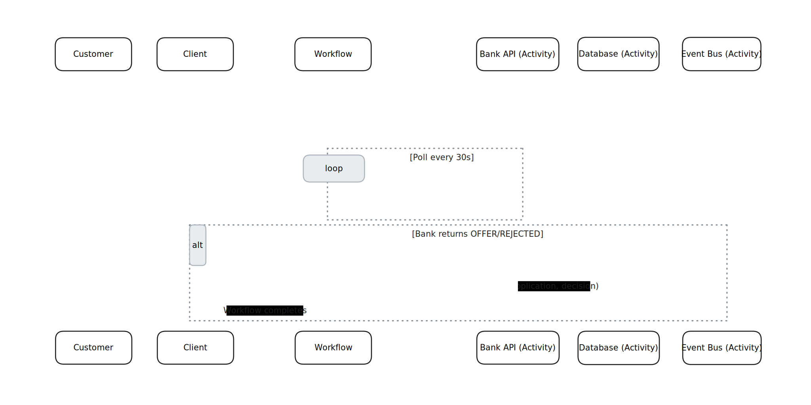
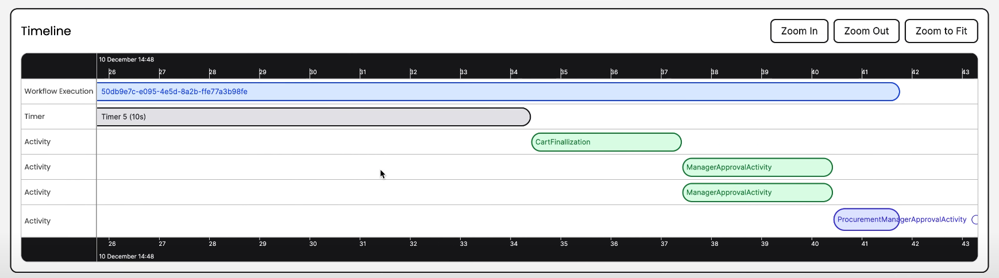
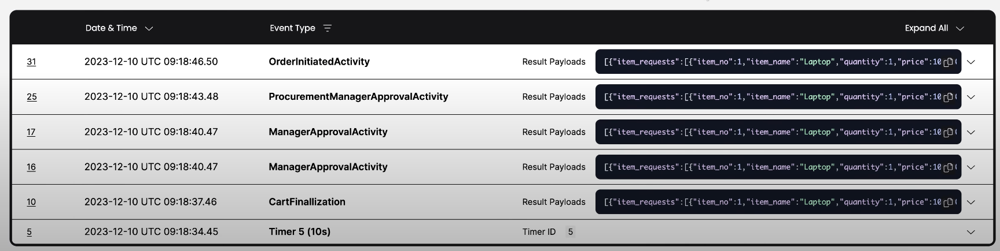

<!-- 
#f72585,
 #ca31b3,
 #5b2679,
 #003554,
 #ff4800,
 #ff6d00,
 #fe0000,
 #0c63e7,
 #09a6f3,
 #07c8f9
-->

<!-- ## Slide (Section: temporal-typescript-onboarding) -->
<!-- .slide: data-background-color="var(--brand-orange-500)" -->

# From Bull to Temporal — Mental Model

<pre>
<code class="markdown" data-line-numbers="1-13">Bull ➜ Temporal (one-to-one intuition)
- Queue name          ➜ Task Queue (string)
- Job                  ➜ Workflow Execution (durable state machine)
- Processor            ➜ Worker (runs Workflows/Activities)
- Job data             ➜ Workflow arguments / Signals / Updates
- Progress / state     ➜ Queries (read) + Signals/Updates (write)
- Repeats / backoff    ➜ Server-enforced retry policies
- Cron                 ➜ Schedules / Cron on Workflows

Golden rule:
Workflows orchestrate (no I/O, deterministic).
Activities do I/O (DB/API/files), safely retried by the server.
You talk to Workflows via Client (start, signal, query, result).
</code>
</pre>

---

<!-- ## Slide (Section: temporal-typescript-onboarding) -->
<!-- .slide: data-background-color="var(--brand-pink-600)" -->

# Simplified Loan Application Workflow with Temporal

---

<!-- ## Slide (Section: temporal-typescript-onboarding) -->
<!-- .slide: data-background-color="var(--brand-purple-700)" -->

# Install & Run Local Temporal

<pre>
<code class="bash" data-line-numbers="1-9">brew install temporal   # macOS
temporal server start-dev
# Temporal Web UI: http://localhost:8233
# Frontend: localhost:7233

npm i -D typescript ts-node
npm i @temporalio/client @temporalio/worker @temporalio/workflow nanoid axios
</code>
</pre>

---

<!-- ## Slide (Section: temporal-typescript-onboarding) -->
<!-- .slide: data-background-color="var(--brand-fuchsia-500)" -->

# Project Layout

<pre>
<code class="bash" data-line-numbers="1-10">src/
  shared.ts        # types & constants
  activities.ts    # I/O: bank API, DB, event bus
  workflows.ts     # orchestration
  worker.ts        # runs workflows & activities
  client.ts        # starts workflow when "application.created" arrives
</code>
</pre>

---

<!-- ## Slide (Section: temporal-typescript-onboarding) -->
<!-- .slide: data-background-color="var(--brand-blue-600)" -->

# `activities.ts` (Bank API + DB)

<pre>
<code class="typescript" data-line-numbers="1-35">import axios from 'axios';
import { LoanApplication, LoanDecision, sleep } from './shared';

export async function sendToBank(app: LoanApplication): Promise&lt;void&gt; {
  console.log('Sending application to bank API:', app);
  await axios.post(`https://api.bank/${app.bankId}/apply`, app);
}

export async function checkBankDecision(app: LoanApplication): Promise&lt;LoanDecision&gt; {
  // simulate polling
  console.log('Polling bank API for decision...');
  await sleep(200);
  const res = await axios.get(`https://api.bank/${app.bankId}/decision/${app.customerId}`);
  return res.data.decision as LoanDecision;
}

export async function persistDecision(app: LoanApplication, decision: LoanDecision) {
  console.log(`Persisting decision "${decision}" for customer ${app.customerId}`);
  // e.g. INSERT INTO loan_applications ...
}

export async function publishEvent(app: LoanApplication, decision: LoanDecision) {
  console.log(`Publishing event: customer ${app.customerId} is ${decision}`);
  // e.g. Kafka/NATS publish
}
</code>
</pre>

---

<!-- ## Slide (Section: temporal-typescript-onboarding) -->
<!-- .slide: data-background-color="var(--brand-sky-500)" -->

# `workflows.ts` (basic orchestration)

<pre>
<code class="typescript" data-line-numbers="1-45">import * as wf from '@temporalio/workflow';
import type * as activities from './activities';
import { LoanApplication, LoanDecision } from './shared';

const { sendToBank, checkBankDecision, persistDecision, publishEvent } =
  wf.proxyActivities&lt;typeof activities&gt;({
    startToCloseTimeout: '1 minute',
  });

export async function loanApplicationWorkflow(app: LoanApplication): Promise&lt;void&gt; {
  // send application
  await sendToBank(app);

  let decision: LoanDecision = 'PENDING';

  // poll every 30s until offer/rejected
  await wf.condition(
    async () =&gt; {
      decision = await checkBankDecision(app);
      return decision !== 'PENDING';
    },
    '30s' // check every 30 seconds
  );

  // persist result
  await persistDecision(app, decision);

  // publish event
  await publishEvent(app, decision);
}
</code>
</pre>

---

<!-- ## Slide (Section: temporal-typescript-onboarding) -->
<!-- .slide: data-background-color="var(--brand-blue-600)" -->

# `worker.ts`

<pre>
<code class="typescript" data-line-numbers="1-25">import { Worker, NativeConnection } from '@temporalio/worker';
import * as activities from './activities';
import { TASK_QUEUE } from './shared';

async function run() {
  const connection = await NativeConnection.connect();

  const worker = await Worker.create({
    connection,
    taskQueue: TASK_QUEUE,
    workflowsPath: require.resolve('./workflows'),
    activities,
  });

  console.log(`Worker polling on "${TASK_QUEUE}"`);
  await worker.run();
}

run().catch((err) =&gt; {
  console.error(err);
  process.exit(1);
});
</code>
</pre>

---

<!-- ## Slide (Section: temporal-typescript-onboarding) -->
<!-- .slide: data-background-color="var(--brand-purple-700)" -->

# `client.ts`

Workflow starts when **loan application created event** arrives.

<pre>
<code class="typescript" data-line-numbers="1-30">import { Client, Connection } from '@temporalio/client';
import { loanApplicationWorkflow } from './workflows';
import { TASK_QUEUE, LoanApplication } from './shared';

// Mock application.created event handler
async function onApplicationCreated(event: any) {
  const app: LoanApplication = {
    customerId: event.customerId,
    amount: event.amount,
    termMonths: event.termMonths,
    bankId: event.bankId,
  };

  const connection = await Connection.connect();
  const client = new Client({ connection });

  const handle = await client.workflow.start(loanApplicationWorkflow, {
    workflowId: `loan-${app.customerId}-${app.bankId}`,
    taskQueue: TASK_QUEUE,
    args: [app],
  });

  console.log(`Started loan workflow: ${handle.workflowId}`);
}

// Simulate event trigger
onApplicationCreated({
  customerId: '123',
  amount: 50000,
  termMonths: 24,
  bankId: 'swedbank',
});
</code>
</pre>

---

<!-- ## Slide (Section: temporal-typescript-onboarding) -->
<!-- .slide: data-background-color="var(--brand-red-600)" -->

# Extending with Signal & Query

- **Query**: check current decision status (without waiting for workflow to complete).  
- **Signal**: allow external system to cancel/stop workflow (e.g., customer withdrew).

---

<!-- ## Slide (Section: temporal-typescript-onboarding) -->
<!-- .slide: data-background-color="var(--brand-sky-400)" -->

# Adding Signal & Query to Workflow

<pre>
<code class="typescript" data-line-numbers="1,2,6,8,9,16">export const cancelSignal = wf.defineSignal('cancel');
export const statusQuery = wf.defineQuery&lt;LoanDecision&gt;('status');

export async function loanApplicationWorkflow(app: LoanApplication): Promise&lt;void&gt; {
  let decision: LoanDecision = 'PENDING';
  let cancelled = false;

  wf.setHandler(cancelSignal, () =&gt; (cancelled = true));
  wf.setHandler(statusQuery, () =&gt; decision);

  await sendToBank(app);

  // Poll until bank decides OR cancelled
  await wf.condition(
    async () =&gt; {
      if (cancelled) {
        decision = 'REJECTED';
        return true;
      }
      decision = await checkBankDecision(app);
      return decision !== 'PENDING';
    },
    '30s'
  );

  await persistDecision(app, decision);
  await publishEvent(app, decision);
}
</code>
</pre>

---

<!-- ## Slide (Section: temporal-typescript-onboarding) -->
<!-- .slide: data-background-color="var(--brand-fuchsia-500)" -->

# Using Signal & Query from Client

<pre>
<code class="typescript" data-line-numbers="1-30">import { cancelSignal, statusQuery } from './workflows';

async function interact(client: Client, workflowId: string) {
  const handle = client.workflow.getHandle(workflowId);

  // Query current status
  const status = await handle.query(statusQuery);
  console.log('Status:', status);

  // Send cancel signal
  await handle.signal(cancelSignal);
  console.log('Sent cancel signal');

  const final = await handle.result();
  console.log('Workflow finished with:', final);
}
</code>
</pre>

---

<!-- ## Slide (Section: temporal-typescript-onboarding) -->
<!-- .slide: data-background-color="var(--brand-purple-700)" -->

# Bull  

- Bull "jobs" are short-lived.  
- In Bull, retry/backoff logic runs in worker memory.  
- Bull queues only know about jobs; Temporal keeps **durable workflow state + history**.  
- Bull requires custom code for progress updates; Temporal offers **Signals (write)** and **Queries (read)**.  

---

<!-- ## Slide (Section: temporal-typescript-onboarding) -->
<!-- .slide: data-background-color="var(--brand-purple-700)" -->

# Temporal

- Temporal is perfect for long-running business processes or state machines.  
- Temporal Workflows can run for days, handle retries, timers, signals.  
- Temporal allows * (fan-out, waiting, compensation).  
- Temporal activities are **idempotent & retried automatically**, Bull retries are simpler but less robust. 
- Temporal supports **built-in cron & schedules** across workflows.   
- Temporal scales horizontally with many workers in different languages.  
- Temporal UI provides **workflow history + debugging**, Bull has limited introspection.  
- Temporal can **continue workflows across versions** (workflow versioning).  

---

<!-- ## Slide (Section: temporal-typescript-onboarding) -->
<!-- .slide: data-background-color="var(--brand-orange-500)" -->

# Activity Timeline

---

<!-- ## Slide (Section: temporal-typescript-onboarding) -->
<!-- .slide: data-background-color="var(--brand-blue-600)" -->

# Activity Progress

